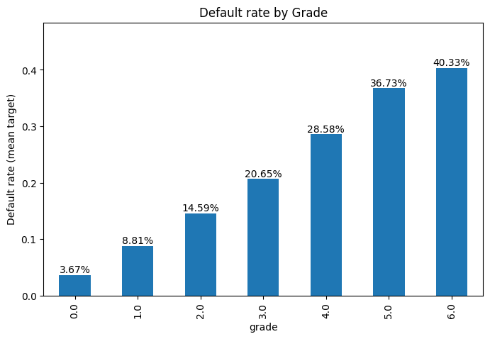
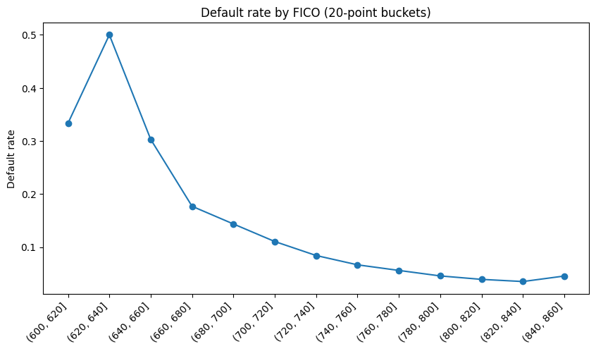
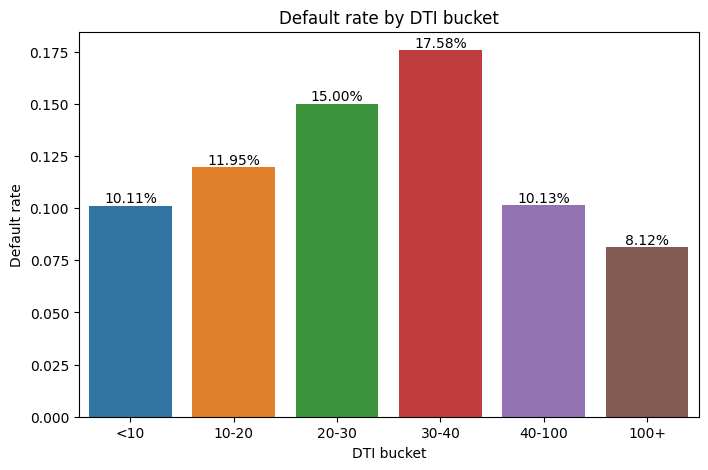
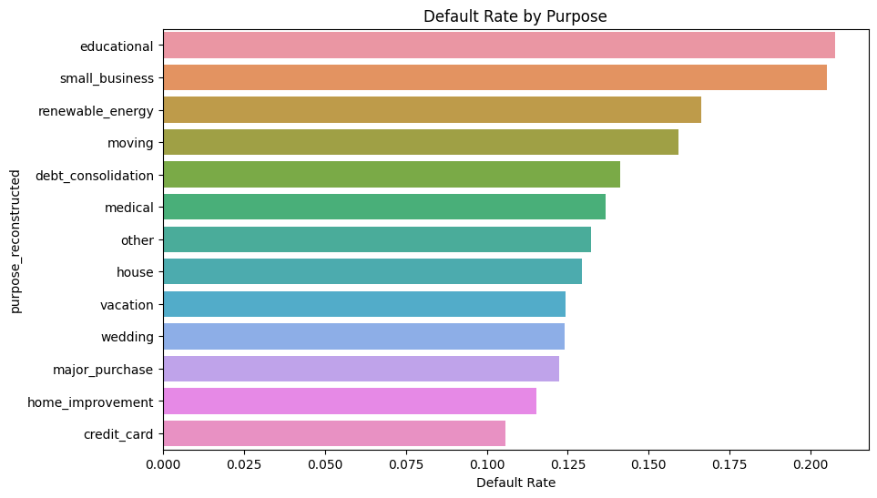
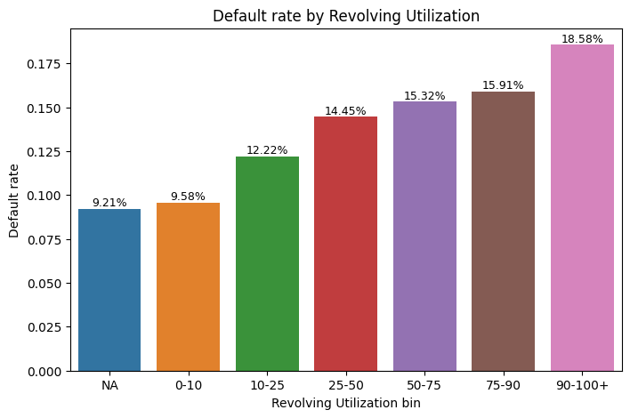
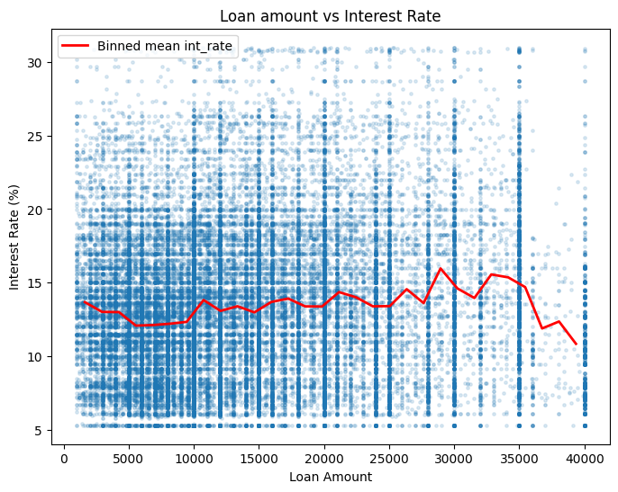
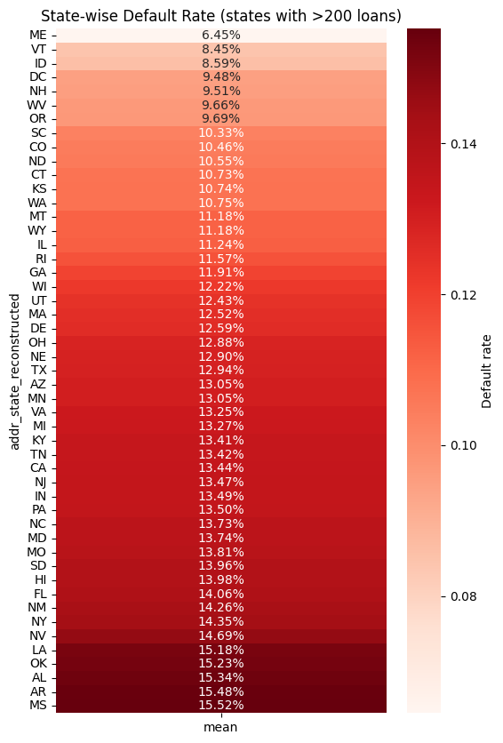

# 🏦 Loan Default Prediction Using Lending Club Dataset

### _Machine Learning | Data Analysis | Risk Modeling_

This project analyzes the **Lending Club 2007–2018 dataset** and builds a machine-learning model to predict **loan default risk**, a key problem in financial analytics and credit risk departments 

---

## 📌 **Project Overview**

Financial institutions rely heavily on **risk scoring models** to determine whether a loan applicant is likely to default.  
This project performs:

- **Exploratory Data Analysis (EDA)**
- **Data cleaning & preprocessing**
- **Feature engineering**
- **Categorical encoding**
- **Model training using XGBoost**
- **Evaluation using credit-risk metrics**

---

## 🗂️ **Dataset**

**Source:** Lending Club public data (2007–2018 Q4)  
**Size:** 2M+ records, 100+ features  
**Target Variable:** `loan_status` → converted to _Default_ vs _Fully Paid_

Link: https://www.kaggle.com/datasets/wordsforthewise/lending-club

---

## 🧹 1. Data Cleaning & Preprocessing

Key steps performed:

- Removed unnecessary columns (high missing values, leakage variables, IDs)
- Handled numerical + categorical data
- Converted date columns (e.g., `issue_d`)
- Encoded high-cardinality fields (`purpose`, `addr_state`, `home_ownership`)
- Extracted:
    - `issue_year`
    - `issue_month`
- Converted Lending Club grades (`A–G`) into numerical form
- One-hot encoded categorical features

---

## 🔍 2. Exploratory Data Analysis (EDA)

Explored:

- Loan distribution by purpose, grades, and state
- Correlation of features with default
- Income, interest rate, installment analysis
- Borrower credit behavior trends over years

Visuals included:

- Countplots (loan purposes, grades)
- Histograms (loan amount, interest rate)
- Boxplots
- Heatmaps for correlations

---

## 🏗️ 3. Feature Engineering

Created additional meaningful features:

- `grade_num`
- `sub_grade_num`
- `sub_grade_level`
- Time features based on `issue_d`

Transformed high-cardinality categorical variables using **target encoding** where needed.

---

## 🤖 4. Model Selection

After trying several classifiers, the best performance came from:

### ✔ **XGBoost Classifier**

Configured with:

- Proper handling of class imbalance
- Tuned depth, learning rate, and number of estimators

---

## 📈 5. Model Performance

|Metric|Score|
|---|---|
|**ROC–AUC**|**0.75**|
|**Recall (Defaulters)**|**0.73**|
|**Precision (Defaulters)**|**0.23**|
|**Accuracy**|**65%**|

### Interpretation:

- **High recall** → captures most people who _default_ (good for banks)
- **Low precision** → some non-defaulters are falsely flagged
- **Moderate AUC** → strong baseline risk model, improvable with tuning

---

## 🧠 6. Key Insights

- Interest rate, grade, sub-grade, and debt-to-income ratio are strong risk indicators    
- Borrowers with lower grades (E–G) show significantly higher default rates.
- Time-based features improved model performance.
- XGBoost handled non-linear relationships effectively.

---

## 🧾 Dashboard Screenshots

---

## 📌 How to Run

`pip install jupyter notebook`

Open the notebook:

`notebook.ipynb`

---

## 👨‍💻 Author

**[Tarun Patel]**  
Aspiring Data Analyst | Python | Machine Learning | Business Analytics  
LinkedIn: [https://www.linkedin.com/in/tarunpatelofficial/]
